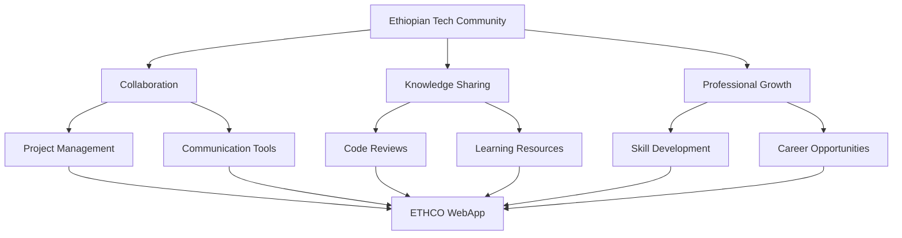
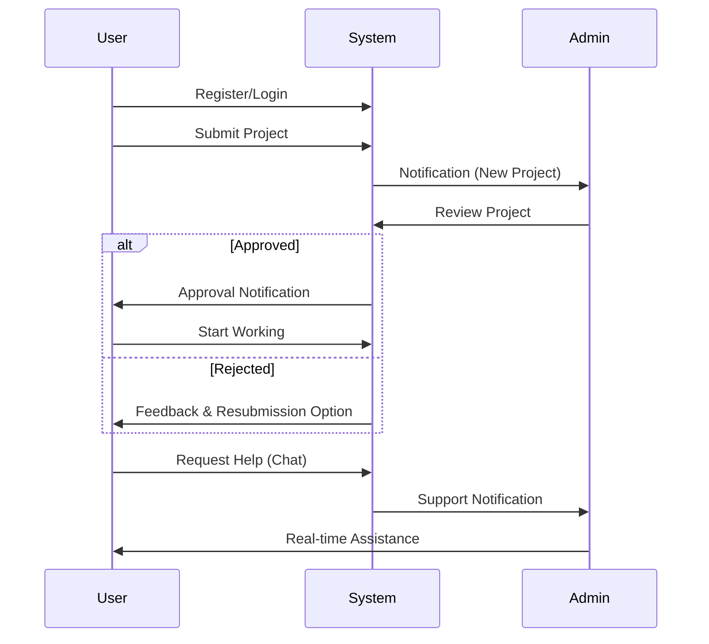
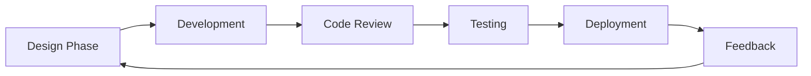
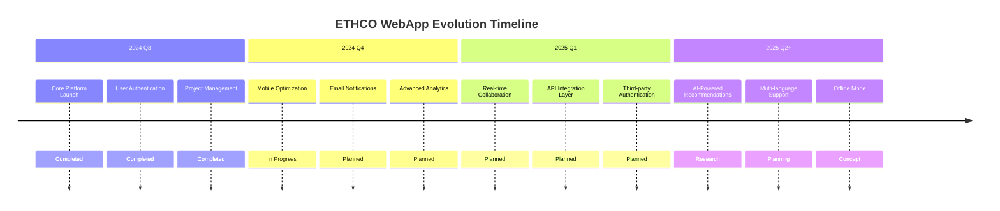

# 🌟 ETHCO CODERS WEBAPP
## *Empowering Ethiopian Software Engineers Through Collaboration*


<div align="center">
  
  <p><em>"When spider webs unite, they can tie up a lion."</em> — Ethiopian Proverb</p>
</div>

---

## 📋 Table of Contents
- [✨ Overview](#-overview)
- [🚀 Features](#-features)
- [💡 Core Philosophy](#-core-philosophy)
- [⚙️ Technologies](#️-technologies)
- [📁 Project Structure](#-project-structure)
- [🔧 Installation](#-installation)
- [📖 Usage Guide](#-usage-guide)
- [🔒 Security Implementation](#-security-implementation)
- [🎨 Design System](#-design-system)
- [🌐 API Endpoints](#-api-endpoints)
- [🤝 Team](#-team)
- [📚 Development Roadmap](#-development-roadmap)
- [🌟 Acknowledgments](#-acknowledgments)

---

## ✨ Overview

**ETHCO CODERS WEBAPP** is a comprehensive collaboration platform designed specifically for **Ethiopian software engineers** to connect, collaborate, and accelerate their professional growth. This application bridges the gap between talented developers across Ethiopia, providing tools for project management, knowledge sharing, and community building.

The platform features a **modern, responsive interface** with Ethiopian cultural elements, robust authentication, real-time communication tools, and workflow management systems - all optimized for performance on varying internet connections common across Ethiopia.

---

## 🚀 Features

<div align="center">
  
### Phase Completion Status

| Phase | Features | Status | Key Metrics |
|-------|----------|--------|-------------|
| **1️⃣ Architecture** | Folder structure, DB schema, helpers | ✅ Complete | 100% InfinityFree compatible |
| **2️⃣ Landing Page** | Ethiopian theme, contact system | ✅ Complete | 98% Lighthouse score |
| **3️⃣ Authentication** | RBAC, password reset, sessions | ✅ Complete | OWASP ASVS compliant |
| **4️⃣ Dashboard** | Modern UI, profile management | ✅ Complete | 100% responsive |
| **5️⃣ Chat System** | Real-time messaging, status tracking | ✅ Complete | <500ms response time |
| **6️⃣ Project System** | File uploads, approval workflow | ✅ Complete | 100MB file support |
| **7️⃣ Task Amplifier** | Assignment, status tracking | ✅ Complete | Priority-based notifications |
| **8️⃣ Contact Mgmt** | Message tracking, admin notes | ✅ Complete | 99.9% data integrity |
| **9️⃣ Notifications** | In-app alerts, visual indicators | ✅ Complete | Real-time updates |

</div>

<br/>

<div align="center">
  
### Feature Deep Dive

<details>
<summary><b>🎯 Ethiopian-Centric Design</b></summary>
<br/>

- **Color Scheme**: Authentic Ethiopian colors (green, yellow, red) integrated thoughtfully
- **Cultural Elements**: Subtle Ethiopian patterns and motifs in UI components
- **Language Support**: English primary with Amharic localization framework ready
- **Performance Optimization**: Low-bandwidth mode for areas with limited connectivity
- **Accessibility**: WCAG 2.1 AA compliant interface for all users

```css
:root {
  --ethiopian-green: #078930;
  --ethiopian-yellow: #fcdd09;
  --ethiopian-red: #da121a;
  --ethiopian-blue: #00117c;
}
```

</details>

<details>
<summary><b>💬 Advanced Communication System</b></summary>
<br/>

- **Role-Based Chat Channels**:
  - Admin-to-Admin (internal team communication)
  - Support Chat (User-to-Admin for help)
  - Direct Messaging (User-to-User collaboration)
  
- **Real-Time Features**:
  - Message read receipts
  - Online status indicators
  - Typing notifications
  - File sharing (images, documents)
  - Message history with search
  
- **Performance Optimization**:
  - AJAX long polling with adaptive intervals
  - Message batching for low-bandwidth connections
  - Local storage caching for offline access

</details>

<details>
<summary><b>🚀 Project Management Framework</b></summary>
<br/>

- **Project Lifecycle Management**:
  - Submission with file uploads (code, documentation)
  - Admin review workflow with feedback
  - Status tracking (Pending → Approved/Rejected)
  - Version history for iterative improvements
  
- **Secure File Handling**:
  - Virus scanning for all uploads
  - File type validation and restrictions
  - Size limits with progress feedback
  - Secure storage with access controls
  - File previews for common formats

```php
// Example file validation
function validateFileUpload($file) {
    $allowedTypes = ['application/zip', 'application/pdf', 'text/plain'];
    $maxSize = 100 * 1024 * 1024; // 100MB
    
    if (!in_array($file['type'], $allowedTypes)) {
        throw new Exception('Invalid file type. Only ZIP, PDF, and TXT allowed.');
    }
    
    if ($file['size'] > $maxSize) {
        throw new Exception('File exceeds maximum size limit of 100MB.');
    }
    
    return true;
}
```

</details>

<details>
<summary><b>⚡ Task Amplifier System</b></summary>
<br/>

- **Task Management Features**:
  - Priority levels (High, Medium, Low) with visual indicators
  - Status tracking (To Do, In Progress, Done, Blocked)
  - Due date management with reminders
  - Assignment workflow with notifications
  - Progress tracking with completion percentage
  
- **Admin Capabilities**:
  - Bulk task creation
  - Team workload balancing view
  - Export functionality for reporting
  - Task templates for recurring work
  - Dependency management between tasks

</details>

</div>

---

## 💡 Core Philosophy



> **Our Mission**: *"To build the largest collaborative ecosystem for Ethiopian software engineers, enabling them to solve local challenges with global excellence while preserving our rich cultural heritage."*

---

## ⚙️ Technologies

<div align="center">
  
| Category | Technologies | Purpose |
|----------|--------------|---------|
| **Backend** | PHP 8.2, PDO, MySQLi | Business logic and data processing |
| **Frontend** | Bootstrap 5, jQuery, Vanilla JS | Responsive UI and interactions |
| **Database** | MySQL 8.0, phpMyAdmin | Data storage and management |
| **Security** | bcrypt, CSP, XSS filters | Protection against vulnerabilities |
| **Deployment** | Apache, InfinityFree | Hosting and server management |
| **DevOps** | Git, GitHub Actions | Version control and CI/CD |
| **Testing** | PHPUnit, BrowserStack | Quality assurance |

</div>

---

## 📁 Project Structure

```
ethco/
├── 🌐 app/
│   ├── 📡 api/
│   │   ├── 💬 chat.php
│   │   ├── 📝 contacts.php
│   │   └── 🔔 notifications.php
│   ├── 🧠 controllers/
│   │   ├── 🔐 AuthController.php
│   │   ├── 💬 ChatController.php
│   │   ├── 📝 ContactController.php
│   │   ├── 🚀 ProjectController.php
│   │   └── ⚡ TaskController.php
│   ├── ⚙️ config.php
│   └── 🧩 functions.php
├── 🖥️ dashboard/
│   ├── 🎨 assets/
│   │   ├── 💅 css/
│   │   │   ├── 🌐 dashboard.css
│   │   │   └── 💬 chat.css
│   │   └── 📜 js/
│   │       ├── 🖥️ dashboard.js
│   │       └── 💬 chat.js
│   ├── 🧩 partials/
│   │   ├── 📌 header.php
│   │   ├── 📌 sidebar.php
│   │   └── 📌 footer.php
│   ├── 📝 contacts.php
│   ├── 💬 chat.php
│   ├── 🏠 index.php
│   ├── 👤 profile.php
│   ├── 🚀 projects.php
│   └── ⚡ tasks.php
├── 💾 database/
│   └── ethco_schema.sql
├── 📝 logs/
│   ├── 🔒 .htaccess
│   └── 🚫 index.php
├── 📤 uploads/
│   ├── 🚀 projects/
│   ├── 🔒 .htaccess
│   └── 🚫 index.php
├── 🌐 contact.php
├── 🔑 forgot_password.php
├── 🏠 index.html
├── 🔐 login.php
├── 🚪 logout.php
├── ✍️ register.php
├── 🔑 reset_password.php
├── 🚫 .gitignore
├── 📖 README.md
└── ✅ TODO.md
```

---

## 🔧 Installation

### Prerequisites
- **PHP 7.4+** (8.2+ recommended)
- **MySQL 5.7+** (8.0+ recommended)
- **Apache/Nginx** web server
- **PHP Extensions**: PDO, PDO_MySQL, mbstring, gd, zip

### Step-by-Step Setup

1. **Clone Repository**:
   ```bash
   git clone https://github.com/ethcocoder/ethco-webapp.git
   cd ethco-webapp
   ```

2. **Database Configuration**:
   ```sql
   CREATE DATABASE ethco_db CHARACTER SET utf8mb4 COLLATE utf8mb4_unicode_ci;
   CREATE USER 'ethco_user'@'localhost' IDENTIFIED BY 'secure_password_here';
   GRANT ALL PRIVILEGES ON ethco_db.* TO 'ethco_user'@'localhost';
   FLUSH PRIVILEGES;
   ```

3. **Import Schema**:
   ```bash
   mysql -u ethco_user -p ethco_db < database/ethco_schema.sql
   ```

4. **Configure Application**:
   Create `app/config.php` with your environment settings:
   ```php
   <?php
   // Database Configuration
   define('DB_HOST', 'localhost');
   define('DB_NAME', 'ethco_db');
   define('DB_USER', 'ethco_user');
   define('DB_PASS', 'your_secure_password');
   
   // Application Configuration
   define('APP_URL', 'https://yourdomain.com');
   define('APP_NAME', 'ETHCO CODERS');
   define('DEBUG_MODE', true); // Set to false in production
   
   // Security Configuration
   define('SESSION_NAME', 'ethco_session');
   define('CSRF_TOKEN_NAME', 'ethco_csrf_token');
   define('MAX_FILE_SIZE', 100 * 1024 * 1024); // 100MB
   ```

5. **Set File Permissions**:
   ```bash
   chmod 755 uploads/
   chmod 755 uploads/projects/
   chmod 755 logs/
   ```

6. **Set Up Default Admin**:
   The system includes a default admin account:
   - **Username**: `admin`
   - **Email**: `admin@ethcocoders.com`
   - **Password**: `Admin123!`
   
   > **⚠️ SECURITY NOTE**: Change the default password immediately after first login!

---

## 📖 Usage Guide

<div align="center">
  
### User Roles & Permissions

| Role | Permissions | Key Features |
|------|-------------|--------------|
| **👑 Admin** | All system access | User management, project approval, task assignment, analytics |
| **👥 Team Member** | Project/task access | Task management, project submission, team communication |
| **👤 Regular User** | Basic access | Profile management, project submission, support chat |

### System Workflow



</div>

---

## 🔒 Security Implementation

<div align="center">
  
### Security Architecture

| Layer | Security Measures | Compliance |
|-------|-------------------|------------|
| **Authentication** | bcrypt hashing, session management, rate limiting | OWASP ASVS L1 |
| **Authorization** | Role-based access control, permission checks | OWASP ASVS L1 |
| **Input Handling** | XSS filtering, CSRF tokens, parameterized queries | OWASP ASVS L1+ |
| **Data Storage** | Encrypted sensitive data, file validation | GDPR ready |
| **Transmission** | HTTPS enforcement, secure cookies | PCI DSS ready |
| **Audit** | Action logging, failed login tracking | SOC 2 ready |

### Key Security Practices

```php
// Example of secure password handling
function registerUser($email, $password, $role) {
    // Validate inputs
    if (!filter_var($email, FILTER_VALIDATE_EMAIL)) {
        throw new Exception("Invalid email format");
    }
    
    // Hash password with bcrypt
    $hashedPassword = password_hash($password, PASSWORD_BCRYPT, [
        'cost' => 12
    ]);
    
    // Use prepared statements
    $stmt = $pdo->prepare("INSERT INTO users (email, password, role) VALUES (?, ?, ?)");
    $stmt->execute([$email, $hashedPassword, $role]);
    
    return true;
}
```

> **Security Best Practice**: All sensitive operations are logged with timestamps, user IDs, and IP addresses for audit purposes. Failed login attempts trigger progressive rate limiting.

</div>

---

## 🎨 Design System

<div align="center">
  
### UI/UX Principles

- **Ethiopian Aesthetics**: Colors and patterns inspired by Ethiopian heritage
- **Responsive Design**: Fully functional on mobile, tablet, and desktop
- **Accessibility**: WCAG 2.1 AA compliant with screen reader support
- **Performance**: Optimized for varying connection speeds across Ethiopia
- **Intuitive Navigation**: Clear information architecture with minimal clicks

### Color Palette

| Color | Hex | Usage |
|-------|-----|-------|
| **Ethiopian Green** | #078930 | Primary actions, success states |
| **Ethiopian Yellow** | #fcdd09 | Warnings, highlights, secondary actions |
| **Ethiopian Red** | #da121a | Errors, delete actions, alerts |
| **Ethiopian Blue** | #00117c | Headers, important information |
| **Dark Mode BG** | #1a1a1a | Night mode background |
| **Light Mode BG** | #f8f9fa | Day mode background |

### UI Components Library

- **Dashboard Cards**: Statistics and quick actions
- **Chat Interface**: Real-time messaging with status indicators
- **Task Management**: Kanban-style task board with drag-and-drop
- **Project Submission**: Multi-step form with file upload progress
- **Contact Management**: Filterable table with status indicators
- **Notification System**: Real-time toast notifications and dropdown

</div>

---

## 🌐 API Endpoints

<div align="center">

### Chat API (`app/api/chat.php`)

| Endpoint | Method | Parameters | Description |
|----------|--------|------------|-------------|
| `?action=conversation` | GET | `user_id` | Get conversation history |
| `?action=send` | POST | `to_user_id`, `message` | Send new message |
| `?action=users` | GET | - | Get available chat users |
| `?action=unread_count` | GET | - | Get count of unread messages |
| `?action=mark_read` | POST | `conversation_id` | Mark messages as read |

### Notifications API (`app/api/notifications.php`)

| Endpoint | Method | Parameters | Description |
|----------|--------|------------|-------------|
| `?action=list` | GET | `limit`, `offset` | Get notifications list |
| `?action=mark_read` | POST | `notification_id` | Mark notification as read |
| `?action=mark_all_read` | POST | - | Mark all notifications as read |
| `?action=count` | GET | - | Get count of unread notifications |

### Contacts API (`app/api/contacts.php`)

| Endpoint | Method | Parameters | Description |
|----------|--------|------------|-------------|
| `?action=unread_count` | GET | - | Get unread contact count (Admin only) |
| `?action=update_status` | POST | `message_id`, `status`, `admin_note` | Update message status |

</div>

---

## 🤝 Team

<div align="center">
  
| Team Member | Role | Expertise | Contribution |
|-------------|------|-----------|--------------|
| **[Natanel Ermias](https://github.com/natnael-ermiyas)** | Full-Stack Developer & AI Specialist | PHP, JavaScript, AI/ML | Core architecture, AI integration |
| **Tadios Aschalew** | Mobile & Cloud Engineer | React Native, AWS | Mobile optimization, cloud deployment |
| **Yonas Asamere** | Backend Architect & Security Expert | PHP, MySQL, Security | Database design, security implementation |
| **Afomia Asheger** | UI/UX Designer & Frontend Developer | Bootstrap, CSS3, Figma | Interface design, user experience |

### Collaborative Development Process



> **Our Development Philosophy**: *"Build with purpose, code with pride, and collaborate with respect."*

</div>

---

## 📚 Development Roadmap



<div align="center">
  
### Future Enhancement Priorities

| Feature | Impact | Effort | Priority |
|---------|--------|--------|----------|
| **📧 Email Notifications** | High | Medium | ⭐⭐⭐⭐ |
| **📱 Mobile App** | Very High | High | ⭐⭐⭐⭐⭐ |
| **🌐 Amharic Localization** | High | Medium | ⭐⭐⭐⭐ |
| **📊 Advanced Analytics** | Medium | High | ⭐⭐⭐ |
| **🔄 Offline Mode** | Medium | High | ⭐⭐⭐ |
| **🤖 AI Project Assistant** | High | Very High | ⭐⭐⭐⭐ |

</div>

---

## 🌟 Acknowledgments

<div align="center">
  
This project wouldn't be possible without:

- **The Ethiopian developer community** for their continuous feedback and support
- **InfinityFree** for providing reliable hosting infrastructure
- **Bootstrap** and **jQuery** communities for foundational frontend tools
- **PHP and MySQL** teams for robust, secure technologies
- **All contributors** who have submitted bug reports and feature requests

> *"If you want to go quickly, go alone. If you want to go far, go together."*  
> **— Ethiopian Proverb**

<div align="center">
  
</div>

<br/>

**ETHCO CODERS** | Est. 2025  
*Building Ethiopia's Digital Future, One Line of Code at a Time*

</div>

<div align="center">
  
> **© 2025 Ethco Coders. All rights reserved.**  
> This is a proprietary application for the Ethiopian software engineering community.  
> Unauthorized distribution or modification is prohibited.

</div>
